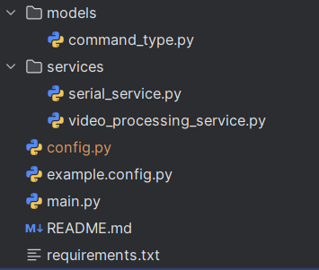
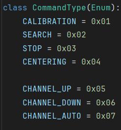

# Структура файлов проекта

<figure><figcaption></figcaption></figure>

Models - Модели данных, типы, Enum

`command_type` - Содержит класс `CommandType` который наследуется от Enum и определяет какая команда будет отправлена на Arduino.

Services - Вспомогательные классы для работы с определёнными компонентами проекта.

`serial_service` - Сервис для отправки команд и получения телеметрии с Arduino.

`video_processing_service` - Сервис для получения и обработки видеопотока с приемника.

`config.py` - Хранит конфигурации приложения.

`example.config.py` - Пример заполнения конфигурации приложения.

`main.py` - Главный файл приложения.

`requirements.txt` - Файл со списком необходимых пакетов для установки.
