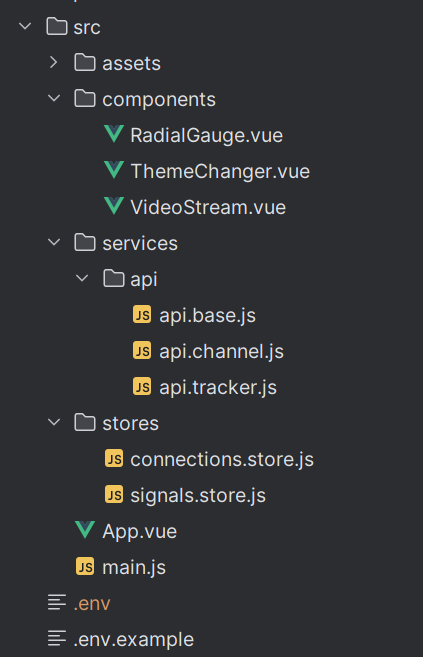

# Структура файлов проекта

<figure><figcaption></figcaption></figure>

Components

`RadiantGauge` - Компонент для отрисовки циферблатных индикаторов. Используется для отображения силы сигнала на каждой антенне.\
           .png>)

`ThemeChanger` - Компонент для смены темы со светлой на тёмную и наоборот. Отображается в виде кнопки

.png>)       .png>)

`VideoStream` -&#x20;

