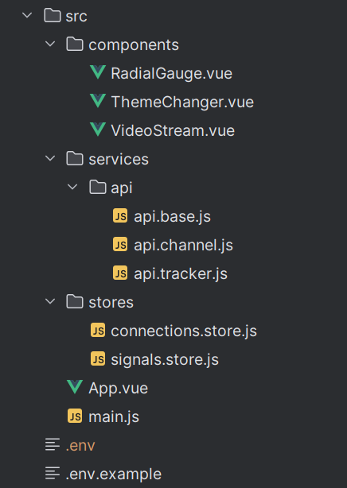
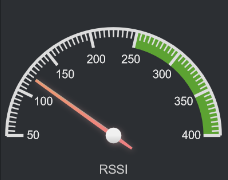

# Структура файлов проекта

<figure><figcaption></figcaption></figure>

Components - Компоненты используемые в проекте

`RadiantGauge` - Компонент для отрисовки циферблатных индикаторов. Используется для отображения силы сигнала на каждой антенне.

           .png>)

`ThemeChanger` - Компонент кнопки для смены темы со светлой на тёмную и наоборот.

.png>)       .png>)

`VideoStream` - Компонент отвечающий за получение и отображение видеопотока и телеметрии с WebSocket подключения.&#x20;

Services - Вспомогательные скрипты для работы с Бекендом

`api.base.js` - Обработка конфигураций из `.env` и создание Axios и WebSocket клиентов для отправки запросов.

`api.channel.js` - Отправка запросов связанных с управлением каналом.

`api.tracker.js` - Отправка запросов связанных с управлением трекером.

Stores - Хранение состояния приложения

`connections.store.js` - Хранение состояния подключения и пинг подключения.

`signals.store.js` - Хранит текущую силу сигнала на антеннах.

`App.vue` - Само приложение.

`main.js` - Точка с которой стартует инициализация приложения.

`.env` - Конфигурационный файл приложения

`.env.example` - Пример заполнения конфигурационного файла приложения
