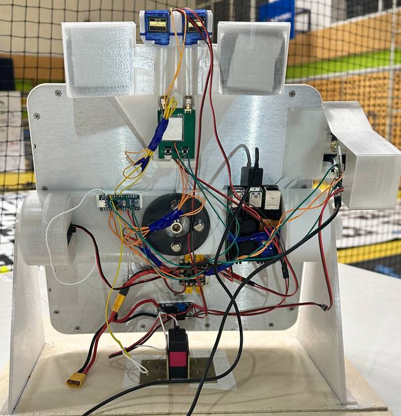
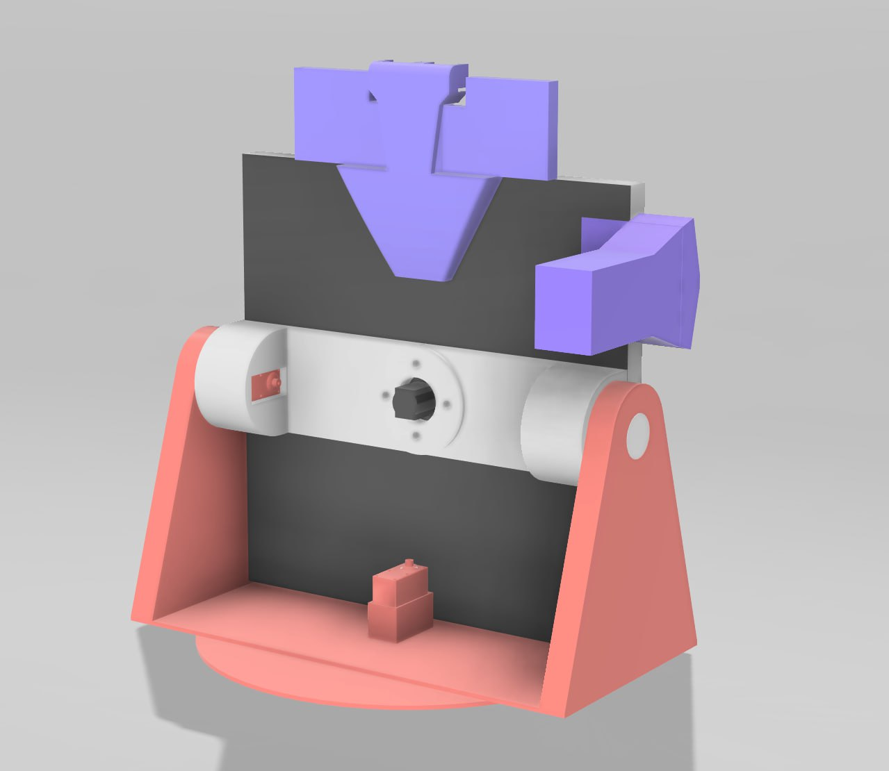
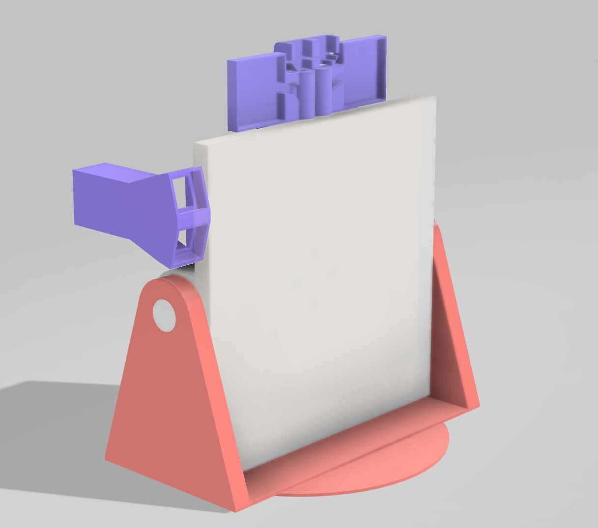
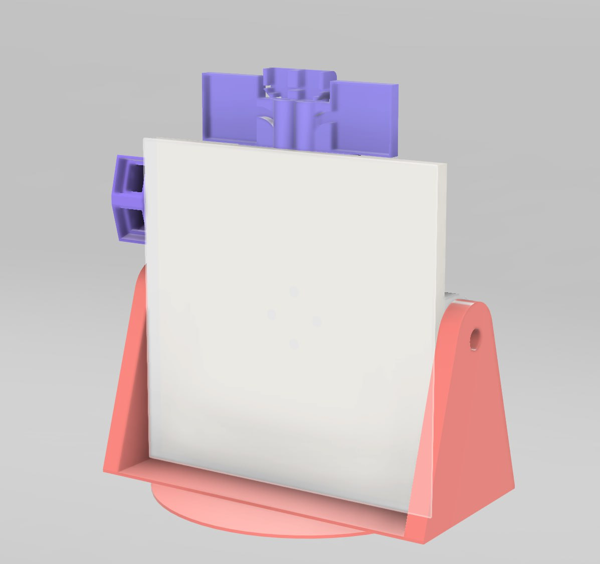

---
layout:
  title:
    visible: true
  description:
    visible: true
  tableOfContents:
    visible: true
  outline:
    visible: true
  pagination:
    visible: true
---

# Компоненты

<figure><figcaption></figcaption></figure>

<figure><figcaption></figcaption></figure>

 

<figure><figcaption></figcaption></figure>

 

<figure><figcaption></figcaption></figure>

* Дрон Clover
* Arduino Nano, Raspberry Pi 5
* Сервопривод 90кг  2 шт
* Сервопривод 25 кг  2 шт
* LiPo АКБ
* Foxeer Lollipop 4 2шт
* FOXEER ECHO 2 5.8G-9dbi RHCP 2 шт
* Большая принимающая антенна
* TBS UNITY PRO32 5G8 HV
* SkyDroid PF V 5.8G
* Соединительные провода
* PETG и PLA пластик
* Понижающий преобразователь
