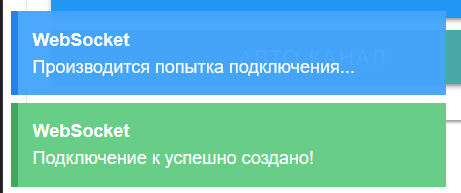

# Беспроводное подключение для использования и управления антенным трекером

### **Подключение к BACKEND**

<figure><figcaption></figcaption></figure>

 

<figure><figcaption></figcaption></figure>

### **Внешний вид веб-интерфейса**

<figure><figcaption></figcaption></figure>

 

<figure><figcaption></figcaption></figure>

