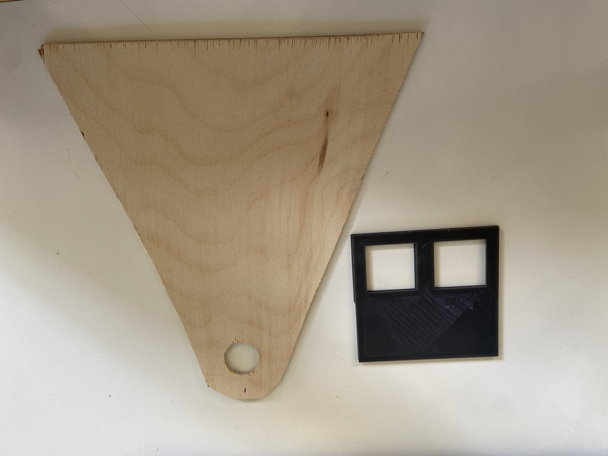

# Использование легких и прочных материалов

Большая часть проекта собирается из фанеры и деталей, напечатанных на 3D Принтере. Остальное - мелкие расходники.

<figure><figcaption></figcaption></figure>
