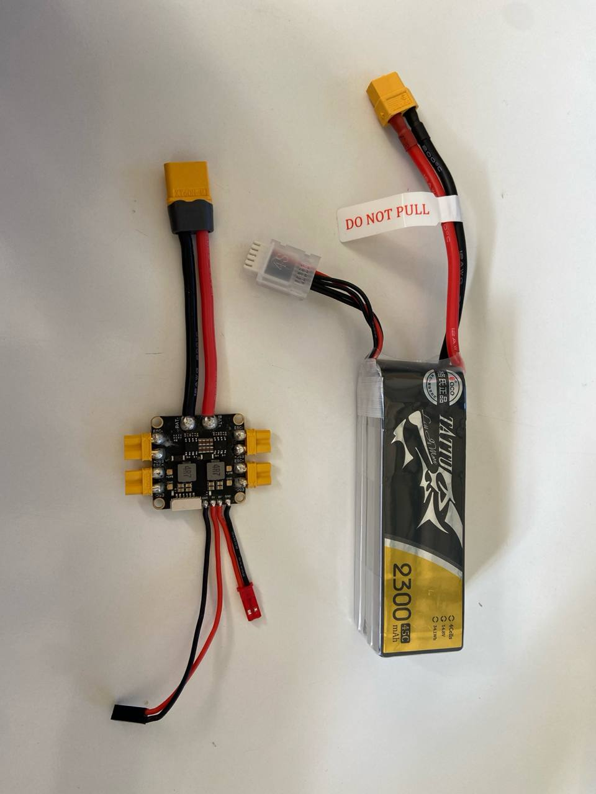

# Система должна работать от LiPo аккумуляторов, совместимых с БПЛА

Система питается от LiPo аккумуляторов за счёт платы распределения питания, взятой с одного из дронов.

<figure><figcaption></figcaption></figure>
